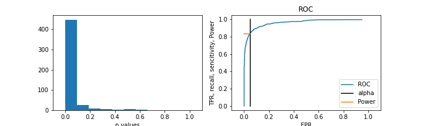

## Статистика, проверка гипотез

Генерируем две выборки А и В биномиальным распределением.
Формулируем гипотезы Н0 и Н1.
Многократно семплируя выборки вычисляем значение p-val (как часто будем наблюдать такие же и большие различия).
Используя полученное распределение p-val строим ROC кривую и определяем мощность теста при пороге значимости alpha.

Далее рассматриваем способы ускорения АВ тестов и определяем их мощность.
- bootstrap
- bucketing (группировка)
- линейная регрессия
- permutation (перебор)

